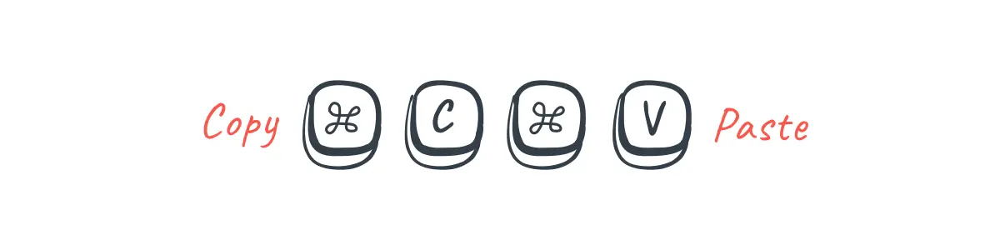

Two usability heuristics that could be improved in the Glaffy website are:
==========================================================================

*Consistency and standards: The website could benefit from increased consistency and adherence to established standards in terms of its interface design and functionality. For example, using standard UI components and layouts, such as dropdown menus and breadcrumb navigation, would make it easier for users to navigate the site and understand its various features. Additionally, using consistent visual design elements, such as typography, colors, and iconography, would help create a cohesive and unified experience for the user.

*Flexibility and efficiency of use: The website could benefit from increased flexibility and efficiency in terms of how users interact with it. For example, allowing users to customize the site's interface or keyboard shortcuts would enable them to complete tasks more quickly and efficiently. Additionally, providing clear and concise instructions or hints for less experienced users would help them understand how to use the site more effectively.

To increase consistency and standards, one concrete step could be to conduct a heuristic evaluation of the website's interface and identify areas where it deviates from established design patterns or best practices. Once these issues are identified, they can be addressed by making changes to the interface design or functionality to bring it in line with established standards.

To increase flexibility and efficiency of use, one concrete step could be to conduct user testing and observe how users interact with the website in real-world scenarios. Based on the findings of the user testing, the website's interface could be refined to make it more intuitive and efficient to use. For example, if users are having difficulty locating certain features or completing specific tasks, the interface could be modified to make these features more prominent or the tasks more streamlined. Additionally, providing keyboard shortcuts or customizable interfaces could improve the efficiency of use for more experienced users.

The Look and Vibe
=========================================================

I am looking into two color schemes:

 

Fonts:
------

-Montserrat
-Roboto
-Pacifico

My color choices are lighthearted and dont take themselves seriously. There is an theme that can be selected for Colorblindness if needed that will adjust the colors for accessability. The colors imply fun and that lighthearted nature is reflected in the alternate design as well.

Fonts will be: Pacifico for the logo area, Montserrat for all headers, and Roboto for the paragraphs. I really feel that the designes all work well with each other to provide a visual balance. This particular grouping of fonts leans into the overall sense of fun and compliments both color themes.
